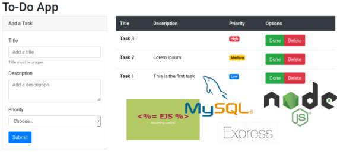

# To-Do App

  Con la intención de contribuir al conocimiento de los alumnos de la UTP haciendo un simple CRUD de tareas utilizando JavaScript. :smiley:

  

  03 / junio / 2019

  ## Prerrequisitos

  * Fundamentos de JavaScript
  * Fundamentos de SQL
  * Herramientas instaladas
    * Node js
    * MySQL
    * Editor de texto

## Configuración Inicial

  Node es un motor de JavaScript, lo que significa que gracias a él podemos usar JavaScript fuera del navegador, ya que este lenguaje fue pensado para usarse en los navegadores. Node se desarrolló con base al motor V8, que es el motor de JavaScript para Google Chrome.

  Para comenzar, vamos a crear una carpeta con el nombre `to-do-app` que será donde esté alojado el proyecto. En una terminal, dentro de la ubicación de la carpeta que recién creamos escribimos el siguiente comando:

  ``` bash
  npm init
  ```

  `npm` significa `Node Package Manager` y es el sistema de gestión de paquetes por defecto para node. Con él podemos descargar módulos para hacer funcionar nuestro proyecto como frameworks o librerías. `npm init` ayuda a crear un archivo llamado `package.json` a partir de los datos que insertes (también es posible crear el archivo manualmente), este archivo es el que tiene la información del proyecto.

  Una vez escrito `npm init` nos pedirá los datos del proyecto. Puedes meter los datos que desees, sólo que en `entry point` escribe `src/app.js`, que será el punto de partida del proyecto (que aún no creamos). En caso de que se te haya pasado, puedes abrir el archivo `package.json` y cambiarlo manualmente en `main`.

  Ahora vamos a instalar las dependencias que utilizará el proyecto, en este ejemplo utilizaremos el framework `Express` que hará el proceso más rápido. Instalaremos el módulo de MySQL para node para conectar a la base de datos. Instalaremos el módulo `UUID` para generar UUID y evitar los ID incrementales y el último módulo es `EJS` que es un motor de plantillas, este en particular significa Embedded JavaScript que como su nombre lo dice, JavaScript estará embebido en el documento HTML para rellenar datos.

  Para instalarlos utilizaremos `npm` de la siguiente manera:

  ``` bash
  npm install express mysql uuid ejs --save
  ```

  La opción `--save` permite registrar las dependencias en el `package.json`, puedes abrir este archivo y ahora verás las dependencias.

  Existen otras tipo de dependencias que son las de desarrollo, a diferencia de las anteriores que le sirven al proyecto para funcionar, estas dependencias ayudan al desarrollador para trabajar fácilmente. Para este proyecto utilizaremos `Nodemon` que ayuda a recargar automáticamente el servidor cada que existan nuevos cambios. Para instalarlo escribimos el siguiente comando, y se guardará como dependencia de desarrollo con `--save-dev`:

  ``` bash
  npm install nodemon --save-dev
  ```

  Crearemos un script que correrá `Nodemon` en el proyecto. En el `package.json` hay ya un script que dice `test`, vamos a reemplazar el `test` por `dev` (aunque le puedes poner el nombre que gustes), y en el contenido reemplazamos lo que tiene por `nodemon` y al final te quedará algo parecido a esto:

  ``` json
  {
    "name": "to-do-app",
    "version": "1.0.0",
    "description": "To-Do App",
    "main": "src/app.js",
    "scripts": {
      "dev": "nodemon"
    },
    "repository": {
      "type": "git",
      "url": "git+https://github.com/maeneser/to-do-app.git"
    },
    "author": "Manuel Meneses",
    "license": "ISC",
    "bugs": {
      "url": "https://github.com/maeneser/to-do-app/issues"
    },
    "homepage": "https://github.com/maeneser/to-do-app#readme",
    "dependencies": {
      "ejs": "^2.6.1",
      "express": "^4.17.1",
      "mysql": "^2.17.1",
      "uuid": "^3.3.2"
    },
    "devDependencies": {
      "nodemon": "^1.19.1"
    }
  }
  ```

## Configuración del Servidor

  Crearemos el archivo principal que habíamos declarado en el `main` del `package.json`. Para eso crearemos una carpeta llamada `src` y dentro de ella el archivo `app.js`.
  
  En `app.js` importamos el framework que utilizaremos `Express` y luego lo inicializamos:

  ``` JavaScript
  const express = require('express')
  const app = express()
  ```

  Configuramos a `Express` para que las peticiones del lado del cliente se tomen en formato `JSON`:

  ``` JavaScript
  app.use(express.json())
  app.use(express.urlencoded({
    extended: false
  }))
  ```
  
  Y finalmente levantaremos el servidor en el puerto 3000:

  ``` JavaScript
  app.listen(3000, () => {
    console.log('Server on port 3000')
  })
  ```

  Después de esta configuración, desde la consola escribe:

  ``` bash
  node src/app.js
  ```

  Node es el motor que ejecuta JavaScript, así que le decimos que ejecute el archivo que está en la ruta `src/app.js`. Después de esto, entra desde tu navegador a [`http://localhost:3000`](http://localhost:3000) y verás la magia. No mostrará nada interesante aún, pero el servidor ya está levantado.

  ### app.js

  ``` JavaScript
  const express = require('express')

  const app = express()
  app.use(express.json())
  app.use(express.urlencoded({
    extended: false
  }))

  app.listen(3000, () => {
    console.log('Server on port 3000')
  })
  ```

## Hola Mundo

  Para poder mostrar un `Hola Mundo!!` desde el navegador hay que tener una ruta a la que se acceda, para tener el código ordenado crearemos una carpeta dentro de `src` que se llame `routes`, dentro de esta carpeta crearemos un archivo para las rutas de tareas (En un proyecto grande conviene que tengas tus rutas ordenadas en varios archivos dependiendo de su utilidad), este archivo se va a llamar `taskRoutes.js` y en este archivo empezamos importando el framework que estamos usando (`Express`):

  ``` JavaScript
  const express = require('express')
  const router = express.Router()
  ```

  Al inicializar `Express` lo hacemos con el método Router, ya que sólo esta parte es la que utilizaremos. Router nos permite interactuar con los métodos `HTTP` como `GET`, `POST`, `PUT`, etc.

  Vamos a crear la primera ruta en la raíz:

  ``` JavaScript
  router.get('/', (req, res) => {
    res.send("Hola Mundo!!")
  })
  ```

  Es una ruta con el método `GET` que se llama desde la raíz del nombre de dominio (que en este caso seria [`http://localhost:3000/`](http://localhost:3000/)). Se tiene una función que se desencadena cada vez que se llama a la ruta, estas funciones se conforman por una petición (`Request`) y una respuesta (`Response`) que son las que están como parámetros. Y esta forma de escribir la función con `=>` son las funciones flecha, pero también puedes hacerlo de esta otra forma:

  ``` JavaScript
  router.get('/', function(req, res) {
    res.send("Hola Mundo!!")
  })
  ```

  Cuando se llama la función, manda como respuesta un `Hola Mundo!!`.
  
  Ya estaría todo listo pero antes estas rutas las tenemos que exportar para poderlas importar en el archivo principal (`app.js`), así que para exportarlas agregamos:

  ``` JavaScript
  module.exports = router
  ```

  Y en `app.js` importamos estas rutas:

  ``` JavaScript
  const taskRoutes = require('./routes/taskRoutes')
  ```

  Y ahora se las damos a `Express` para que las lea:

  ``` JavaScript
  app.use(taskRoutes)
  ```

  Ya que todo está en su lugar podemos probarlo, pero tenemos que recargar el proyecto (`ctrl` + `c` y luego correr de nuevo `node src/app.js`), pero para eso nos ayuda `Nodemon`, así que detenemos el servicio y ahora escribimos:

  ``` bash
  npm run dev
  ```

  `npm` que es el gestor de paquetes, le decimos que vamos a correr un script con la opción `run` que se llama `dev` (que fue el que creamos en el `package.json`) el cual hace funcionar a `Nodemon` en este proyecto.
  
  Refresca tu navegador y mira los cambios.

  ### taskRoutes.js

  ``` JavaScript
  const express = require('express')
  const router = express.Router()

  router.get('/', (req, res) => {
    res.send("Hola Mundo!!")
  })

  module.exports = router
  ```

  ### app.js

  ``` JavaScript
  const express = require('express')
  const taskRoutes = require('./routes/taskRoutes')

  const app = express()
  app.use(express.json())
  app.use(express.urlencoded({
    extended: false
  }))
  app.use(taskRoutes)

  app.listen(3000, () => {
    console.log('Server on port 3000')
  })
  ```

### Vista de Tareas

  Vamos a mostrar la vista de tareas. Este proyecto es un CRUD (Create - Read - Update - Delete) de tareas, se podrán crear tareas, se verán en una tabla, al marcar como hecha o para rehacer se actualizarán y se podrán eliminar. Empezaremos por mostrar las tareas.

  Una vez que ya tenemos la ruta del `hola mundo!!`, la utilizaremos para renderizar una vista con HTML en lugar de enviar texto plano. EJS nos ayuda para esto, es JavaScript embebido con el cual podremos hacer un ciclo hasta llenar la tabla con las tareas. Pero antes de eso, hay que decirle a `Express` que lo utilizaremos.

  Hay dos cosas a configurar, en `Express` debemos declarar una variable que se llame `view engine` con la cual podemos decirle el motor de plantillas que vamos a usar, hay varios motores de plantillas que puedes buscar en la página de `npm`.

  ``` JavaScript
  app.set('view engine', 'ejs')
  ```

  La segunda cosa a configurar es otra variable en la que `Express` debe buscar las vistas que se llama `views`. A esta variable le vamos a pasar la ruta a la carpeta en la que crearemos nuestras vistas. Para hacerlo utilizaremos un módulo que ya viene integrado con Node que se llama `Path`:

  ``` JavaScript
  const path = require('path')
  ```

  Con él podemos armar las rutas separando los directorios con `/` o con `\` dependiendo en que sistema operativo que nos encontremos y nosotros no tengamos que modificarlo si cambiamos de un sistema operativo a otro:

  ``` JavaScript
  app.set('views', path.join(__dirname, 'views'))
  ```

  Una vez esto configurado, ya podemos renderizar una vista con `Express`, así que vamos a crear nuestra vista. El objetivo de este documento no es explicar HTML, ni Bootstrap, sólo vamos a explicar EJS, la vista la podrás encontrar al final de esta sección o también [aquí](https://github.com/maeneser/to-do-app/blob/master/src/views/index.ejs), vamos a crear una carpeta dentro de `src` que se llame `views`, y dentro de ahí un archivo llamado `index.ejs`.

  La sintaxis de `EJS` es `<% … %>`, en donde en medio va lo que quieras hacer, si quieres imprimir una variable utiliza la sintaxis `<%= variable1 %>`.

  En el `index.ejs` hay una alerta de error en caso de que al momento de renderizar la vista la variable de `err` trajera alguna información:

  ``` HTML
  <% if (err) { %>
    <div class="alert alert-danger alert-dismissible fade show" role="alert">
      <%= err %>
      <button type="button" class="close" data-dismiss="alert" aria-label="Close">
        <span aria-hidden="true">&times;</span>
      </button>
    </div>
  <% } %>
  ```

  Para renderizar la tabla con la información se hace un `For Each` en caso de que la variable `tasks` trajera información, en caso contrario se renderiza una sola fila para decir que no hay información:

  ``` HTML
  <tbody>
    <% if (tasks.length > 0) { tasks.forEach((task) => { %>
      <tr>
        <!-- Aquí se imprime la información de cada tarea… -->
      </tr>
    <% }) } else { %>
      <tr>
        <th colspan="4">No data</th>
      </tr>
    <% } %>
  </tbody>
  ```

  En caso de que existieran tareas, se imprime la información. Para el caso de las prioridades y el botón de hacer/rehacer se utilizan operadores ternarios para saber los estilos `CSS` que deben usar con `Bootstrap`. Los operadores ternarios son otra forma de hacer condiciones basadas en la estructura:

  Condición ? Verdadero : Falso

  Y en caso de condiciones anidadas:

  Condición 1 ? Verdadero : Condición 2 ? Verdadero : Falso

  Por lo que con `EJS` puedes utilizar esta forma de hacer condiciones para saber qué estilo o que contenido renderizar.

  Se necesita saber qué prioridad tiene cada tarea para saber qué estilos le toca y después saber también qué texto se coloca. En el caso del botón de hacer/rehacer se necesita saber si la tarea está hecha o no para saber si poner un botón verde o gris:

  ``` HTML
  <tr>
    <th><%= task.title %></th>
    <td><%= task.description %></td>
    <td>
      <span class="<%= task.priority == 1 ?
                   'badge badge-primary' :
                   task.priority == 2 ?
                     'badge badge-warning' :
                     'badge badge-danger' %>">
        <%= task.priority == 1 ?
            'Low' :
            task.priority == 2 ?
              'Medium' :
              'High' %>
      </span>
    </td>
    <td>
      <div class="btn-group" role="group">
        <a href="/redo/<%= task.id %>"
          class="<%= task.done ? 'btn btn-secondary' : 'btn btn-success' %>"
          role="button"
          aria-pressed="true">
          <%= task.done ? 'Redo' : 'Done' %>
        </a>
        <a href="/delete/<%= task.id %>" class="btn btn-danger" role="button" aria-pressed="true">Delete</a>
      </div>
    </td>
  </tr>
  ```

  Una vez configurado `EJS` con `Express` y la vista creada, crearemos un nuevo archivo con el fin de tener todo el código organizado, primero creamos una carpeta dentro de `src` llamada `controllers`, y en ella creamos el archivo llamado `taskController.js`. En este archivo crearemos una función para renderizar la vista que como parámetros tiene el `Request` y la `Response` ya que recibirá la petición y dará una respuesta, esta respuesta tiene un estatus 200 que significa que todo salió bien, luego con la función render, renderizará la vista con nombre `index` y como segundo parámetro enviamos la información que necesita la vista para funcionar en formato `JSON`:

  ``` JavaScript
  function Render(req, res) {
    res.status(200).render('index', {
      'err': null,
      'tasks': []
    })
  }
  ```

  Y también la exportamos, pero cómo se harán varias funciones, la exportamos de la siguiente manera:

  ``` JavaScript
  module.exports = {
    Render
  }
  ```

  Sólo queda reemplazar lo que se hará al llamar la ruta principal, en el archivo de rutas (`taskRoutes.js`) importamos el archivo que acabamos de crear:

  ``` JavaScript
  const taskController = require('../controllers/taskController')
  ```

  Reemplazamos la función que tiene para mandar el `Hola Mundo!!` por la función `Render` del archivo `taskController.js`:

  ``` JavaScript
  router.get('/', taskController.Render)
  ```

  Ahora ya está todo bien configurado, pero agregaremos una ruta extra, que nos ayudará en caso de que alguien entre a una ruta que no existe, le mandaremos el famoso error `404 Not Found`:

  ``` JavaScript
  router.all('/*', (req, res) => {
    res.status(404).send("404 Not Found")
  })
  ```

  Ahora guarda todos los cambios y `Nodemon` recargará el servidor y verás los cambios en tu navegador.

  ### app.js

  ``` JavaScript
  const express = require('express')
  const path = require('path')
  const taskRoutes = require('./routes/taskRoutes')

  const app = express()
  app.set('view engine', 'ejs')
  app.set('views', path.join(__dirname, 'views'))
  app.use(express.json())
  app.use(express.urlencoded({
    extended: false
  }))
  app.use(taskRoutes)

  app.listen(3000, () => {
    console.log('Server on port 3000')
  })
  ```

  ### taskController.js

  ``` JavaScript
  function Render(req, res) {
    res.status(200).render('index', {
      'err': null,
      'tasks': []
    })
  }

  module.exports = {
    Render
  }
  ```

  ### taskRoutes.js

  ``` JavaScript
  const express = require('express')
  const taskController = require('../controllers/taskController')

  const router = express.Router()

  router.get('/', taskController.Render)
  router.all('/*', (req, res) => {
    res.status(404).send("404 Not Found")
  })

  module.exports = router
  ```

   ### index.ejs

  ``` HTML
  <!DOCTYPE html>
  <html lang="en">

  <head>
    <meta charset="UTF-8">
    <meta name="viewport" content="width=device-width, initial-scale=1.0">
    <meta http-equiv="X-UA-Compatible" content="ie=edge">
    <link rel="stylesheet"
      href="https://stackpath.bootstrapcdn.com/bootstrap/4.3.1/css/bootstrap.min.css"
      integrity="sha384-ggOyR0iXCbMQv3Xipma34MD+dH/1fQ784/j6cY/iJTQUOhcWr7x9JvoRxT2MZw1T" crossorigin="anonymous">
    <title>To-Do App</title>
  </head>

  <body>
    <div class="container">
      <h1>To-Do App</h1>
      <% if (err) { %>
        <div class="alert alert-danger alert-dismissible fade show" role="alert">
          <%= err %>
          <button type="button" class="close" data-dismiss="alert" aria-label="Close">
            <span aria-hidden="true">&times;</span>
          </button>
        </div>
      <% } %>
      <div class="row">
        <div class="col-md-4">
          <div class="card">
            <div class="card-header">Add a Task!</div>
            <div class="card-body">
              <form action="/create" method="POST" autocomplete="off">
                <div class="form-group">
                  <label for="title">Title</label>
                  <input type="text" class="form-control" id="title" name="title" placeholder="Add a title" required>
                  <small class="form-text text-muted">Title must be unique.</small>
                </div>
                <div class="form-group">
                  <label for="description">Description</label>
                  <textarea class="form-control" id="description" name="description"
                    placeholder="Add a description"></textarea>
                </div>
                <div class="form-group">
                  <label for="priority">Priority</label>
                  <select id="priority" name="priority" class="form-control" required>
                    <option disabled selected>Choose...</option>
                    <option value="3">High</option>
                    <option value="2">Medium</option>
                    <option value="1">Low</option>
                  </select>
                </div>
                <button type="submit" class="btn btn-primary">Submit</button>
              </form>
            </div>
          </div>
        </div>
        <div class="col-md-8">
          <table class="table">
            <thead class="thead-dark">
              <tr>
                <th>Title</th>
                <th>Description</th>
                <th>Priority</th>
                <th>Options</th>
              </tr>
            </thead>
            <tbody>
              <% if (tasks.length > 0) { tasks.forEach((task) => { %>
                <tr>
                  <th><%= task.title %></th>
                  <td><%= task.description %></td>
                  <td>
                    <span class="<%= task.priority == 1 ? 'badge badge-primary' : task.priority == 2 ? 'badge badge-warning' : 'badge badge-danger' %>">
                      <%= task.priority == 1 ? 'Low' : task.priority == 2 ? 'Medium' : 'High' %>
                    </span>
                  </td>
                  <td>
                    <div class="btn-group" role="group">
                      <a href="/redo/<%= task.id %>" class="<%= task.done ? 'btn btn-secondary' : 'btn btn-success' %>"
                        role="button" aria-pressed="true"><%= task.done ? 'Redo' : 'Done' %></a>
                      <a href="/delete/<%= task.id %>" class="btn btn-danger" role="button" aria-pressed="true">Delete</a>
                    </div>
                  </td>
                </tr>
              <% }) } else { %>
                <tr>
                  <th colspan="4">No data</th>
                </tr>
              <% } %>
            </tbody>
          </table>
        </div>
      </div>
    </div>
    <script src="https://code.jquery.com/jquery-3.3.1.slim.min.js"
      integrity="sha384-q8i/X+965DzO0rT7abK41JStQIAqVgRVzpbzo5smXKp4YfRvH+8abtTE1Pi6jizo" crossorigin="anonymous">
    </script>
    <script src="https://cdnjs.cloudflare.com/ajax/libs/popper.js/1.14.7/umd/popper.min.js"
      integrity="sha384-UO2eT0CpHqdSJQ6hJty5KVphtPhzWj9WO1clHTMGa3JDZwrnQq4sF86dIHNDz0W1" crossorigin="anonymous">
    </script>
    <script src="https://stackpath.bootstrapcdn.com/bootstrap/4.3.1/js/bootstrap.min.js"
      integrity="sha384-JjSmVgyd0p3pXB1rRibZUAYoIIy6OrQ6VrjIEaFf/nJGzIxFDsf4x0xIM+B07jRM" crossorigin="anonymous">
    </script>
  </body>

  </html>
  ```

  ## Crear una Tarea

  Empezaremos por crear la base de datos que se utilizará, en este proyecto se trabajará con MySQL. La base de datos se llamará  `to-do-app`:
  
  ``` SQL
  CREATE DATABASE `to-do-app`
  ```

  Y la única tabla que tendrá la base de datos se llamará `tasks`, los UUID son un número de 16 bytes y se compone por 32 dígitos hexadecimales divididos en cinco grupos separados por guiones (17646d96-9568-4ce0-b710-ab9ffd4a1ca4). En otros gestores de base de datos como PostgreSQL existe el tipo `UUID`, pero en MySQL no, por lo que guardaremos el UUID como varchar(36):

  ``` SQL
  CREATE TABLE `tasks` (
    `id` varchar(36) PRIMARY KEY,
    `title` varchar(20) NOT NULL UNIQUE,
    `description` text,
    `priority` tinyint(4) NOT NULL,
    `done` BOOLEAN NOT NULL DEFAULT FALSE
  )
  ```

  Una vez hecho esto, crearemos un `pool` de conexiones. Que son un número de conexiones que tendrá el sistema con la base de datos, al ser un sistema pequeño no tendrá tantas conexiones.

  Crearemos una nueva carpeta llamada `db` dentro del folder `src`, en esta nueva carpeta crearemos un archivo nuevo llamado `conn.js` con el siguiente contenido:

  ``` JavaScript
  const mysql = require('mysql')

  var conn = mysql.createPool({
    connectionLimit: 2,
    host: 'localhost',
    user: 'root',
    password: '',
    database: 'to-do-app'
  })

  module.exports = conn
  ```

  En el límite de conexiones, sólo configuré dos, pero si el sistema crece sería mejor aumentar el `pool` de conexiones.

  Crearemos una nueva función para guardar las tareas dentro del archivo `taskController.js`:

  ``` JavaScript
  function Create(req, res, next) {

  }
  ```

  Esta función, a diferencia de la función `Render` tiene un parámetro extra, el `next`. Hay un concepto que se llama `Middleware` que no son más que capas de funciones, en otras palabras, es una forma de ejecutar una secuencia de funciones. En este caso lo que vamos a hacer es llamar la función `Create` para crear la tarea, una vez creada, mandaremos a llamar la función `Render` para volver a mostrar la vista. El `next` lo que hará es que una vez finalice la función `Create`, pasará a la función siguiente.

  La sentencia `SQL` para insertar la guardaremos en una variable, y los parámetros en la cadena se colocan como `?`:

  ``` JavaScript
  function Create(req, res, next) {
    let sql = 'INSERT INTO tasks VALUES(?, ?, ?, ?, ?)'
  }
  ```

  Ahora, para mapear los parámetros tenemos que importar el módulo de `MySQL`:

  ``` JavaScript
  const mysql = require('mysql')
  ```

  Para poder crear los `UUID` tenemos también que importar este módulo, usaremos la versión 4 la cual consiste en que regresa un `UUID` aleatorio, donde la probabilidad de que se repita uno es casi imposible (por no decir imposible):

  ``` JavaScript
  const uuidv4 = require('uuid/v4')
  ```

  Una vez importado estos módulos, ya podemos usarlos, en la función que estamos haciendo, formateamos la sentencia:

  ``` JavaScript
  function Create(req, res, next) {
    let sql = 'INSERT INTO tasks VALUES(?, ?, ?, ?, ?)'
    let query = mysql.format(sql, [
      uuidv4(),
      req.body.title,
      req.body.description,
      req.body.priority,
      false
    ])
  }
  ```

  El primer parámetro, hace referencia al ID, y llamamos al módulo `UUID` que nos regresará un `UUID`, los demás parámetros los tomaremos del cuerpo de la petición (`Request`), por eso es que todos vienen de `req.body`, y el último es si está hecha la tarea, que por defecto es `false`.

  Para poder enviar la sentencia a la base de datos, tenemos que importar el `pool` de conexiones que hicimos:

  ``` JavaScript
  const conn = require('../db/conn')
  ```

  Ahora con la conexión, podemos enviar la sentencia:

  ``` JavaScript
  function Create(req, res, next) {
    let sql = 'INSERT INTO tasks VALUES(?, ?, ?, ?, ?)'
    let query = mysql.format(sql, [
      uuidv4(),
      req.body.title,
      req.body.description,
      req.body.priority,
      false
    ])
    conn.query(query, (err, result) => {
      if (err) throw err
      console.log(result)
      next()
    })
  }
  ```

   En la función `conn.query`, enviamos la sentencia como primer parámetro, y como segundo parámetro es una función que se llama `CallBack`, este `CallBack` es una función que se ejecuta al momento de que la base de datos regresa una respuesta, esto lo hacemos así, debido a que la base de datos puede tomarse su tiempo en dar una respuesta, por lo que es la forma de toda la vida de hacer las peticiones asíncronamente. En el primer parámetro del `CallBack` recibimos un error en caso de que no se haya ejecutado correctamente la petición, y como segundo parámetro el resultado de la petición.

  Hay un problema con los `CallBack`, el famoso `CallBack Hell`. Imagina que tienes que consultar varias veces la base de datos, o consumir una API, o ambas :scream:. En ese caso tendrías un `CallBack` dentro de otro `CallBack` dentro de otro `CallBack`, eso haría difícil el código de comprender. Aquí un ejemplo muy apocalíptico:

  ``` JavaScript
  function Ejemplo(obj) {
    obj.hasAlgo1((error1, resultado1) => {
      if (error1) throw error1
      obj.hasAlgo2(resultado1, (error2, resultado2) => {
        if (error2) throw error2
        obj.hasAlgo3(resultado2, (error3, resultado3) => {
          if (error3) throw error3
          console.log('El resultado final es:', resultado3)
        })
      })
    })
  }
  ```

  Debido a esto nacieron las promesas, las promesas dan dos resultados, un `Resolve` en caso de que todo haya salido bien, y un `Reject` en caso contrario, el mismo ejemplo anterior pero ahora usando promesas:

  ``` JavaScript
  function Ejemplo(obj) {
    obj.hasAlgo1()
      .then((resultado1) => {
        return obj.hasAlgo2(resultado1)
      })
      .then((resultado2) => {
        return obj.hasAlgo3(resultado2)
      })
      .then((resultado3) => {
        console.log('El resultado final es:', resultado3)
      })
      .catch((cualquierError) => {
        throw cualquierError
      })
  }
  ```

  Las promesas vinieron a facilitar el problema de la legibilidad que tienen los `CallBack` pero después llegó `Async Await` a JavaScript. `Async Await` funciona también con promesas pero aún más legible. Nuevamente el mismo ejemplo pero ahora con `Async Await`:

  ``` JavaScript
  async function Ejemplo(obj) {
    try {
      let resultado1 = await obj.hasAlgo1()
      let resultado2 = await obj.hasAlgo2(resultado1)
      let resultado3 = await obj.hasAlgo3(resultado2)
      console.log('El resultado final es:', resultado3)
    } catch (cualquierError) {
      throw cualquierError
    }
  }
  ```

  Por lo que después de esto, estoy seguro que te sientes convencido(a) de querer usar `Async Await`, cosa que vamos a hacer, pero existe un problema en particular con el módulo de MySQL (no es en todos los casos). Al momento de realizar este documento, el módulo de `MySQL` no regresa promesas, por lo que no podremos usar promesas, pero tampoco `Async Await` ya que este último también depende de las promesas.

  Antes de desanimarnos, los amigos de `Node.js` crearon una herramienta para `promisificar`, lo que significa que podemos convertir lo que necesitemos a un objeto que regresa promesas. Para esto, en el archivo de `conn.js` importamos la herramienta de `promisificación`:

  ``` JavaScript
  const { promisify } = require('util')
  ```

  `util` tiene varias herramientas, pero sólo requerimos `promisify`.

  Y ahora, antes de exportar la conexión (`conn`) la `promisificamos`:

  ``` JavaScript
  conn.query = promisify(conn.query)
  ```

  Ya podemos usar `Async Await`. Vamos a refactorizar la función `Create` de `taskController.js`, es importante colocar `async` antes de `function Create` para indicar que será una función que trabaja con `Async Await`:

  ``` JavaScript
  async function Create(req, res, next) {
    try {
      let sql = 'INSERT INTO tasks VALUES(?, ?, ?, ?, ?)'
      let query = mysql.format(sql, [
        uuidv4(),
        req.body.title,
        req.body.description,
        req.body.priority,
        false
      ])
      await conn.query(query)
    } catch (err) {
      if (err.code === 'ECONNREFUSED')
        req.err = "Connection refused by DB server"
      else if (err.code === 'ER_DUP_ENTRY')
        req.err = "Duplicated tasks' title are not allowed"
      else {
        console.log(err.code)
        console.log(err)
        req.err = 'Internal server error'
      }
    } finally {
      next()
    }
  }
  ```

  Hace lo mismo que la función anterior, sólo le agregué algunas cosas en caso de que existiese un error, se va a mandar un mensaje dependiendo el tipo de error que existe. Ese mensaje de error, lo estoy guardando en `req.err` que es una variable dentro de la petición que originalmente no existe, yo la estoy creando para guardar un mensaje de error y después mostrarla en la vista. Independientemente de lo que haya pasado, al final de todo llamo a `next()` para que pase a la siguiente función (que sería `Render`).

  Sólo queda exportar esta función junto con la de `Render`:

  ``` JavaScript
  module.exports = {
    Create,
    Render
  }
  ```

  En el archivo de rutas tenemos una ruta así:

  ``` JavaScript
  router.get('/', taskController.Render)
  ```

  Agregaremos otra ruta idéntica, la diferencia es que en vez de ser llamada con `GET`, será llamada con `POST`, pero para evitar duplicar código escribindolo de esta manera (que funciona igualmente):

  ``` JavaScript
  router.get('/', taskController.Render)
  router.post('/', taskController.Create, taskController.Render)
  ```

  Lo que haremos es juntarlas en una, de esta manera:

  ``` JavaScript
  router.route('/')
    .get(taskController.Render)
    .post(taskController.Create, taskController.Render)
  ```

  Y así es más legible. Si se llama esa ruta con `GET`, mandará a llamar a la función `Render`, si esa misma ruta es llamada con `POST`, mandará a llamar a la función `Create` y después a la función `Render`.

  Guarda tus cambios, `Nodemon` refrescará el proyecto y en tu navegador podrás guardar tareas, por el momento no las mostrará pero corrobora que se guarden en la base de datos.

  ### conn.js

  ``` JavaScript
  const mysql = require('mysql')
  const { promisify } = require('util')

  var conn = mysql.createPool({
    connectionLimit: 2,
    host: 'localhost',
    user: 'root',
    password: '',
    database: 'to-do-app'
  })

  conn.query = promisify(conn.query)

  module.exports = conn
  ```

  ### taskController.js

  ``` JavaScript
  const mysql = require('mysql')
  const uuidv4 = require('uuid/v4')
  const conn = require('../db/conn')

  async function Create(req, res, next) {
    try {
      let sql = 'INSERT INTO tasks VALUES(?, ?, ?, ?, ?)'
      let query = mysql.format(sql, [uuidv4(), req.body.title, req.body.description, req.body.priority, false])
      await conn.query(query)
    } catch (err) {
      if (err.code === 'ECONNREFUSED')
        req.err = "Connection refused by DB server"
      else if (err.code === 'ER_DUP_ENTRY')
        req.err = "Duplicated tasks' title are not allowed"
      else {
        console.log(err.code)
        console.log(err)
        req.err = 'Internal server error'
      }
    } finally {
      next()
    }
  }

  function Render(req, res) {
    res.status(200).render('index', {
      'err': null,
      'tasks': []
    })
  }

  module.exports = {
    Create,
    Render
  }
  ```

  ### taskRoutes.js

  ``` JavaScript
  const express = require('express')
  const taskController = require('../controllers/taskController')

  const router = express.Router()

  router.route('/')
    .get(taskController.Render)
    .post(taskController.Create, taskController.Render)
  router.all('/*', (req, res) => {
    res.status(404).send("404 Not Found")
  })

  module.exports = router
  ```

## Ver las Tareas

  Ya que podemos guardar tareas en la base de datos, es momento de verlas en la vista, ya tenemos una función que se llama `Render` en `taskController.js` que manda la vista, pero ahora lo hace enviando los datos vacíos. Lo que debemos hacer es modificar ese método para que consulte la base de datos y mande la información.

  Antes de enviar la vista crearemos una variable `task` inicianizandola como un arreglo vacío, que será la que se envíe a la vista, por lo que la agregamos también en la respuesta:

  ``` JavaScript
  function Render(req, res) {
    let tasks = []
    res.status(200).render('index', {
      'err': null,
      'tasks': tasks
    })
  }
  ```

  Ahora crearemos la estructura de un `try-catch-finally`, en donde al final se renderiza la vista:

  ``` JavaScript
  function Render(req, res) {
    let tasks = []
    try {

    } catch (err) {

    } finally {
      res.status(200).render('index', {
        'err': null,
        'tasks': tasks
      })
    }
  }
  ```

  Dentro del `try` crearemos la sentencia sql:

  ``` JavaScript
  function Render(req, res) {
    let tasks = []
    try {
      let sql = "SELECT * FROM tasks ORDER BY priority DESC, title"
    } catch (err) {

    } finally {
      res.status(200).render('index', {
        'err': null,
        'tasks': tasks
      })
    }
  }
  ```

  Ahora, esta sentencia se la enviaremos a la base de datos, como estamos usando `Async Await`, hay que colocar `async` antes de `function Render`, y enviamos la sentencia a la base de datos con `await`:

  ``` JavaScript
  async function Render(req, res) {
    let tasks = []
    try {
      let sql = "SELECT * FROM tasks ORDER BY priority DESC, title"
      tasks = await conn.query(sql)
    } catch (err) {

    } finally {
      res.status(200).render('index', {
        'err': null,
        'tasks': tasks
      })
    }
  }
  ```

  En caso de que existiese un error, se manda un mensaje con base a qué tipo de error es:

  ``` JavaScript
  async function Render(req, res) {
    let tasks = []
    try {
      let sql = "SELECT * FROM tasks ORDER BY priority DESC, title"
      tasks = await conn.query(sql)
    } catch (err) {
      if (err.code === 'ECONNREFUSED')
        req.err = 'Connection refused by DB server'
      else {
        console.log(err.code)
        console.log(err)
        req.err = 'Internal server error'
      }
    } finally {
      res.status(200).render('index', {
        'err': null,
        'tasks': tasks
      })
    }
  }
  ```

  Fijate que el error lo estoy guardando en `req.err` (igual que en la función `Create`), en el caso de crear una tarea, puede ya venir con información esta variable desde la función `Create` (recuerda que la función `Create` se ejecuta antes que `Render`), y suponiendo que exista un error en la función `Render` también, va a mostrar el último error que surgió (que será el error ocurrido en `Render`). También puede existir el caso del que no se pudo guardar la tarea, entonces `req.err` ya vendría con un mensaje desde la función `Create`, pero en la función `Render` no hubo ningún problema, en ese caso se mostrará el error que venga de la función `Create`. Ahora estamos enviando un `null` a la vista, sólo tenemos que enviar a la vista cualquier cosa que tenga la variable `req.err` (Si no hubo ningún error, esa variable ni existiría por lo que se enviaría un `null`):

  ``` JavaScript
  res.status(200).render('index', {
    'err': req.err,
    'tasks': tasks
  })
  ```
  No es necesario mover nada más, porque las funciones ya se mandan a llamar, sólo consultamos la base de datos para mandarla al momento de renderizar.

  Guarda los cambios, `Nodemon` actualizará el servidor, refresca tu navegador y mira las tareas.

  ### taskController.js

  ``` JavaScript
  const mysql = require('mysql')
  const uuidv4 = require('uuid/v4')
  const conn = require('../db/conn')

  async function Create(req, res, next) {
    try {
      let sql = 'INSERT INTO tasks VALUES(?, ?, ?, ?, ?)'
      let query = mysql.format(sql, [uuidv4(), req.body.title, req.body.description, req.body.priority, false])
      await conn.query(query)
    } catch (err) {
      if (err.code === 'ECONNREFUSED')
        req.err = "Connection refused by DB server"
      else if (err.code === 'ER_DUP_ENTRY')
        req.err = "Duplicated tasks' title are not allowed"
      else {
        console.log(err.code)
        console.log(err)
        req.err = 'Internal server error'
      }
    } finally {
      next()
    }
  }

  async function Render(req, res) {
    let tasks = []
    try {
      let sql = "SELECT * FROM tasks ORDER BY priority DESC, title"
      tasks = await conn.query(sql)
    } catch (err) {
      if (err.code === 'ECONNREFUSED')
        req.err = 'Connection refused by DB server'
      else {
        console.log(err.code)
        console.log(err)
        req.err = 'Internal server error'
      }
    } finally {
      res.status(200).render('index', {
        'err': req.err,
        'tasks': tasks
      })
    }
  }

  module.exports = {
    Create,
    Render
  }
  ```

## Marcar como Hecha/Rehacer Tarea

  Ahora es momento de poder manipular estas tareas marcandolas como hecha o para rehacer la tarea, que no es nada más que hacer un update.

  Empezaremos por crear una nueva función para editar las tareas dentro del archivo `taskController.js`:

  ``` JavaScript
  async function Redo(req, res, next) {

  }
  ```

  Colocaremos la sentencia para buscar primero la tarea que se quiere actualizar (sólo nos interesa el estado de `done`) dentro de un try-catch-finally ya que estamos usando Async-Await:
  
  ``` JavaScript
  async function Redo(req, res, next) {
    try {
      let sql = 'SELECT done FROM tasks WHERE id = ?'
    } catch (err) {

    } finally {

    }
  }
  ```

  Ahora formateamos la sentencia con el valor que recibiremos por la URL, es por eso que se coloca `req.params.id`, en otras palabras, la variable id dentro de los parámetros (`params`) que recibamos en la petición (`req`), más adelante, cuando creemos la ruta de acceso, explicaré cómo solicitar el parámetro:

  ``` JavaScript
  async function Redo(req, res, next) {
    try {
      let sql = 'SELECT done FROM tasks WHERE id = ?'
      let query = mysql.format(sql, [req.params.id])
    } catch (err) {

    } finally {

    }
  }
  ```

  Ejecutamos la consulta y la guardamos en una variable:

  ``` JavaScript
  async function Redo(req, res, next) {
    try {
      let sql = 'SELECT done FROM tasks WHERE id = ?'
      let query = mysql.format(sql, [req.params.id])
      let task = await conn.query(query)
    } catch (err) {

    } finally {

    }
  }
  ```

  Ya que tenemos la tarea que se va a actualizar, repetimos el proceso anterior pero cambiamos la sentencia a `update`, y de información se le envía el estado negado (para que se cambie sea lo que traiga) y el ID:

  ``` JavaScript
  async function Redo(req, res, next) {
    try {
      let sql = 'SELECT done FROM tasks WHERE id = ?'
      let query = mysql.format(sql, [req.params.id])
      let task = await conn.query(query)
      sql = 'UPDATE tasks SET done = ? WHERE ID = ?'
      query = mysql.format(sql, [!task[0].done, req.params.id])
      await conn.query(query)
    } catch (err) {

    } finally {

    }
  }
  ```

  Ya sólo queda mandar mensaje para cualquier tipo de error en el `catch` y en el `finally` el `next()` para que pase al siguiente middleware (la función Render):

  ``` JavaScript
  async function Redo(req, res, next) {
    try {
      let sql = 'SELECT done FROM tasks WHERE id = ?'
      let query = mysql.format(sql, [req.params.id])
      let task = await conn.query(query)
      sql = 'UPDATE tasks SET done = ? WHERE ID = ?'
      query = mysql.format(sql, [!task[0].done, req.params.id])
      await conn.query(query)
    } catch (err) {
      if (err.code === 'ECONNREFUSED')
        req.err = "Connection refused by DB server"
      else {
        console.log(err.code)
        console.log(err)
        req.err = 'Internal server error'
      }
    } finally {
      next()
    }
  }
  ```

  Una vez hecha la función, la exportamos:

  ``` JavaScript
  module.exports = {
    Create,
    Redo,
    Render
  }
  ```

  Y finalmente, para que esto funcione hay que crear una ruta nueva, que es la que se manda a llamar al momento de presionar el botón de `done/redo` de la vista. En el archivo `taskRoutes.js` agregamos la siguiente ruta:

  ``` JavaScript
  router.get('/redo/:id', taskController.Redo, taskController.Render)
  ```

  Al final del `path` de la ruta, verás `:id`, eso significa que recibiremos un parámetro por la URL con el nombre `id` (que fue lo que se comentó anteriormente).
  
  Guardamos cambios, nodemon recargará el servidor, recarga tu navegador y ahora podrás marcar como hecha o rehacer una tarea.

  ### taskController.js

  ``` JavaScript
  const mysql = require('mysql')
  const uuidv4 = require('uuid/v4')
  const conn = require('../db/conn')

  async function Create(req, res, next) {
    try {
      let sql = 'INSERT INTO tasks VALUES(?, ?, ?, ?, ?)'
      let query = mysql.format(sql, [uuidv4(), req.body.title, req.body.description, req.body.priority, false])
      await conn.query(query)
    } catch (err) {
      if (err.code === 'ECONNREFUSED')
        req.err = "Connection refused by DB server"
      else if (err.code === 'ER_DUP_ENTRY')
        req.err = "Duplicated tasks' title are not allowed"
      else {
        console.log(err.code)
        console.log(err)
        req.err = 'Internal server error'
      }
    } finally {
      next()
    }
  }

  async function Redo(req, res, next) {
    try {
      let sql = 'SELECT done FROM tasks WHERE id = ?'
      let query = mysql.format(sql, [req.params.id])
      let task = await conn.query(query)
      sql = 'UPDATE tasks SET done = ? WHERE ID = ?'
      query = mysql.format(sql, [!task[0].done, req.params.id])
      await conn.query(query)
    } catch (err) {
      if (err.code === 'ECONNREFUSED')
        req.err = "Connection refused by DB server"
      else {
        console.log(err.code)
        console.log(err)
        req.err = 'Internal server error'
      }
    } finally {
      next()
    }
  }

  async function Render(req, res) {
    let tasks = []
    try {
      let sql = "SELECT * FROM tasks ORDER BY priority DESC, title"
      tasks = await conn.query(sql)
    } catch (err) {
      if (err.code === 'ECONNREFUSED')
        req.err = 'Connection refused by DB server'
      else {
        console.log(err.code)
        console.log(err)
        req.err = 'Internal server error'
      }
    } finally {
      res.status(200).render('index', {
        'err': req.err,
        'tasks': tasks
      })
    }
  }

  module.exports = {
    Create,
    Redo,
    Render
  }
  ```

  ### taskRoutes.js

  ``` JavaScript
  const express = require('express')
  const taskController = require('../controllers/taskController')

  const router = express.Router()

  router.route('/')
    .get(taskController.Render)
    .post(taskController.Create, taskController.Render)
  router.get('/redo/:id', taskController.Redo, taskController.Render)
  router.all('/*', (req, res) => {
    res.status(404).send("404 Not Found")
  })

  module.exports = router
  ```